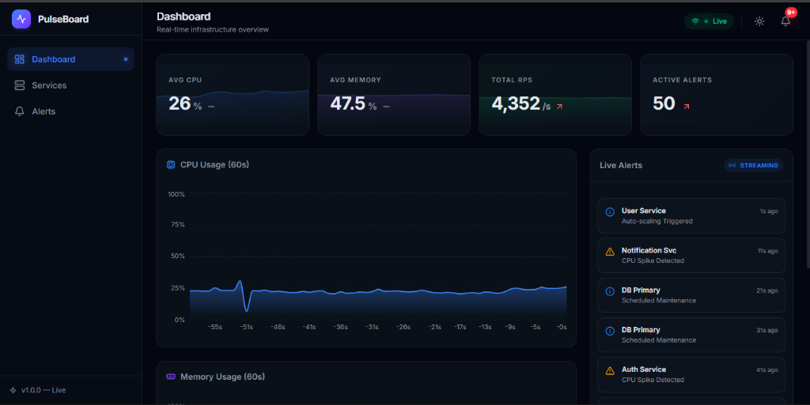
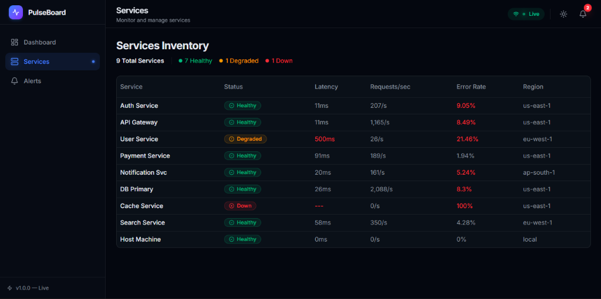
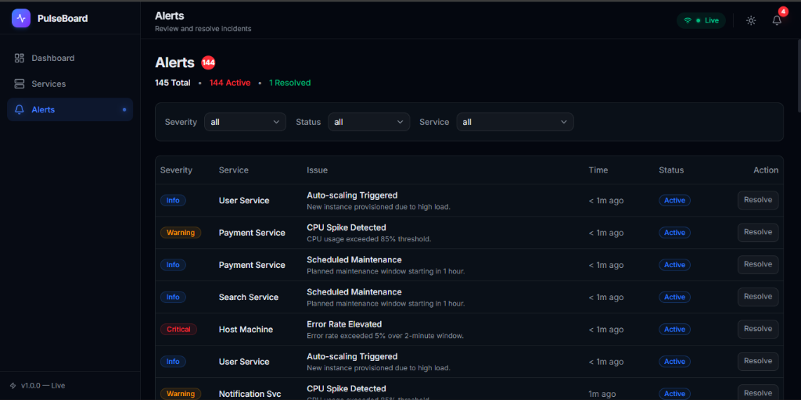

# PulseBoard — Live Infrastructure Metrics Dashboard

> Real-time infrastructure monitoring dashboard streaming live system 
> telemetry and alerts via WebSockets, with interactive chaos controls 
> to simulate and manage service outages.

**Live Demo:** https://pulseboard-git-main-divyal-11s-projects.vercel.app/

---

## Features

- Live WebSocket stream — metrics broadcast every second across 8 services
- Real CPU & RAM monitoring — Host Machine streams your actual system telemetry
- Interactive chaos controls — trigger outages and degrade services in real time
- Live alert feed — critical/warning/info alerts slide in automatically
- Services table — click any service to open a detailed metrics drawer
- Alerts management — filter by severity/status, resolve alerts with optimistic UI
- Dark/light mode toggle
- Fully Dockerised — runs with a single `docker compose up`

---

## Tech Stack

| Layer | Technologies |
|---|---|
| Frontend | Next.js 14 (App Router), TypeScript, Tailwind CSS |
| UI Components | shadcn/ui (Card, Badge, Drawer, Table, Select) |
| Charts | Recharts (AreaChart, LineChart, BarChart) |
| Client State | Zustand |
| Server State | TanStack Query |
| Real-time | WebSocket (ws library) |
| Backend | Node.js, Express |
| System Metrics | systeminformation |
| DevOps | Docker, Docker Compose |

---

## Architecture

```text
┌─────────────────────────────────────────────────────────────────┐
│                        BROWSER (Client)                         │
│                                                                 │
│  ┌─────────────┐  ┌──────────────┐  ┌───────────────────────┐   │
│  │   Zustand   │  │ TanStack     │  │   Recharts            │   │
│  │   Store     │  │ Query Cache  │  │   (Live Charts)       │   │
│  │             │  │              │  │                       │   │
│  │ - alerts[]  │  │ - /alerts    │  │ - CPU area chart      │   │
│  │ - services[]│  │ - /services  │  │ - Memory line chart   │   │
│  │ - metrics{} │  │              │  │                       │   │
│  └──────┬──────┘  └──────┬───────┘  └───────────────────────┘   │
│         │                │                                      │
│         └────────────────┴──────────────────┐                   │
│                                             │                   │
│  ┌──────────────────────────────────────────┴─────────────┐     │
│  │              Next.js App Router (Port 3000)            │     │
│  └───────────────────────────┬────────────────────────────┘     │
└──────────────────────────────┼──────────────────────────────────┘
                               │
               ┌───────────────┴──────────────────┐
               │                                  │
               │ WebSocket (ws://)                │ HTTP REST
               │ Live metrics every 1s            │ Alerts CRUD
               ▼                                  ▼
┌─────────────────────────────────────────────────────────────────┐
│                  Node.js Server (Port 4000)                     │
│                                                                 │
│  ┌─────────────────────┐          ┌──────────────────────────┐  │
│  │   WebSocket Server  │          │      Express REST API    │  │
│  └─────────────────────┘          └──────────────────────────┘  │
│                                                                 │
│  ┌──────────────────────────────────────────────────────────┐   │
│  │                    In-Memory Data Store                  │   │
│  └──────────────────────────────────────────────────────────┘   │
└─────────────────────────────────────────────────────────────────┘
```


---

## Local Setup

### Option 1 — Docker (recommended)

```bash
git clone https://github.com/divyal-11/pulseboard.git
cd pulseboard
docker compose up --build
```

Open http://localhost:3000

### Option 2 — Manual

```bash
# Terminal 1 — Server
cd server
npm install
npm run dev

# Terminal 2 — Frontend
cd frontend
npm install
npm run dev
```

Open http://localhost:3000

---

## Screenshots

### 📊 Live Metrics Dashboard

> Dashboard with live CPU/Memory charts and stat cards

### ⚙️ Services Monitor & Chaos Controls

> Services table with status badges and chaos controls

### 🚨 System Alerts Feed

> Alerts page with severity filters and resolve actions
